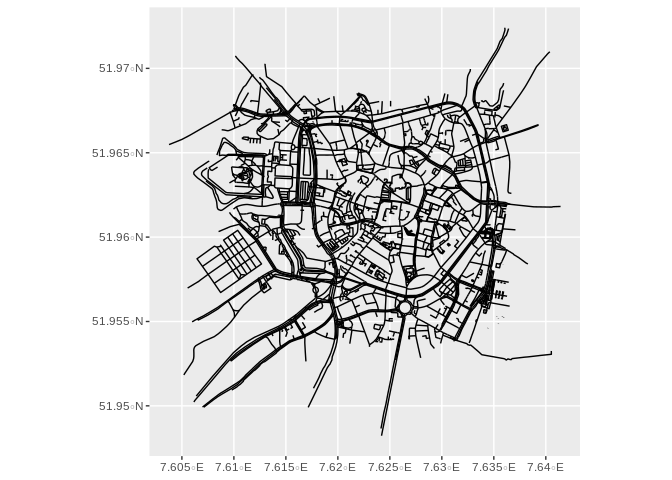
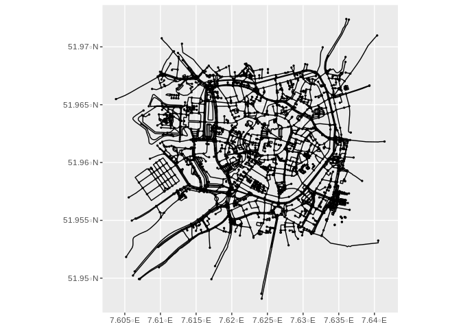
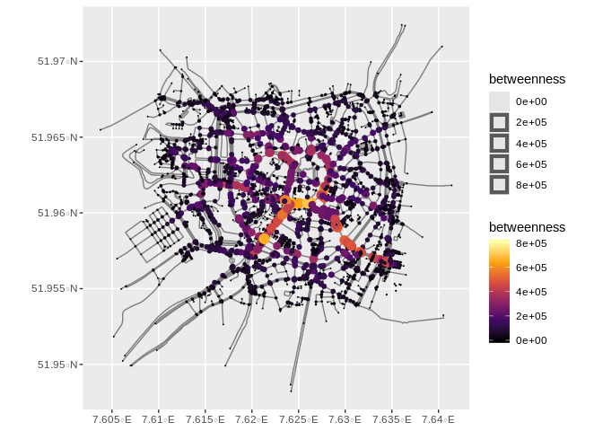
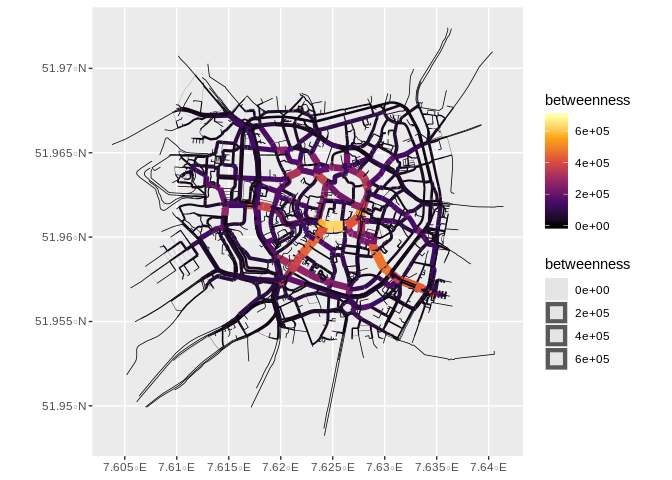
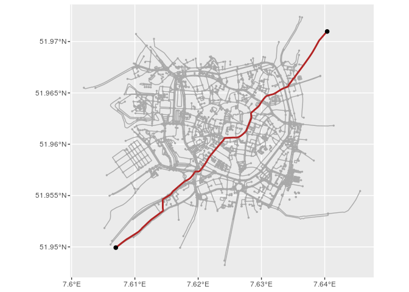
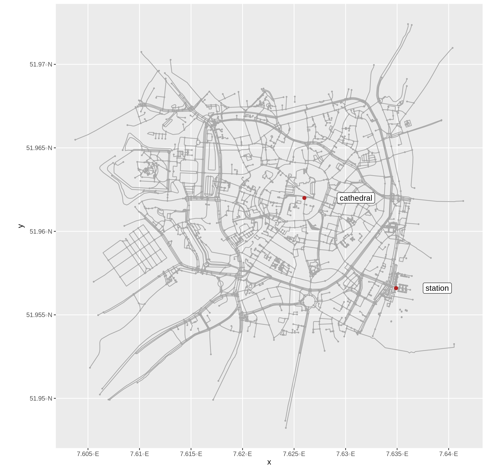

Spatial networks in R with sf and tidygraph
================

## Introduction

Street networks, shipping routes, telecommunication lines, river
bassins. All examples of spatial networks: organized systems of nodes
and edges embedded in space. For most of them, these nodes and edges can
be associated with geographical coordinates. That is, the nodes are
geographical points, and the edges geographical lines.

Such spatial networks can be analyzed using graph theory. Not for
nothing, Leonhard Eulers famous work on the [Seven Bridges of
Köningsberg](https://www.mathsisfun.com/activity/seven-bridges-konigsberg.html),
which laid the foundations of graph theory and network analysis, was in
essence a spatial problem.

In R, there are advanced, modern tools for both the analysis of spatial
data and networks. Furthermore, several packages have been developed
that cover (parts of) spatial network analysis. As stated in this
[github issue](https://github.com/r-spatial/sf/issues/966) and this
[tweet](https://twitter.com/zevross/status/1089908839816794118),
concensus on how best to represent and analyse spatial networks has
proved elusive.

This blogpost demonstrates an approach to spatial networks that starts
with a set of geographic lines, and leads to an object ready to be used
for network analysis. Along the way, we will see that there are still
steps that need to be taken before the process of analyzing spatial
networks in R is user friendly and efficient.

## Existing R packages for spatial networks

Although R was originally designed as a language for statistical
computing, an active ‘R-spatial’ ecosystem has evolved. Powerful and
high performance packages for spatial data analysis have been developed,
thanks largely to interfaces to mature C/C++ libraries such as GDAL,
GEOS and PROJ, notably in the package
[sf](https://github.com/r-spatial/sf) (see
[section 1.5](https://geocompr.robinlovelace.net/intro.html#the-history-of-r-spatial)
of Geocomputation with R for a brief history). Likewise, a number of
packages for graph representation and analysis have been developed,
notably [tidygraph](https://github.com/thomasp85/tidygraph), which is
based on [igraph](https://igraph.org/).

Both sf and tidygraph support the `tibble` class and the broader ‘tidy’
approach to data science, which involves data processing pipelines, type
stability and a convention of representing everything as a data frame
(well a `tibble`, which is a data frame with user friendly default
settings). In sf, this means storing spatial vector data as objects of
class `sf`, which are essentially the same as a regular data frame (or
tibble), but with an additional ‘sticky’ list column containing a
geometry for each feature (row), and attributes such as bounding box and
CRS. Tidygraph stores networks in objects of class `tbl_graph`. A
`tbl_graph` is an `igraph` object, but enables the user to manipulate
both the edges and nodes elements as if they were data frames also.

Both sf and tidygraph are relatively new packages (first released on
CRAN in 2016 and 2017, respectively). It is unsurprising, therefore,
that they have yet to be combined to allow a hybrid, tibble-based
representation of spatial networks.

Nevertheless, a number of approaches have been developed for
representing spatial networks, and some of these are in packages that
have been published on CRAN.
[stplanr](https://github.com/ropensci/stplanr), for instance, contains
the `SpatialLinesNetwork` class, which works with both the
[sp](https://github.com/edzer/sp/) (a package for spatial data analysis
launched in 2005) and sf packages.
[dodgr](https://github.com/ATFutures/dodgr) is a more recent package
that provides analytical tools for street networks, with a focus on
directed graphs (that can have direction-dependent weights,
e.g. representing a one-way street). Other packages seeking to
implement spatial networks in R include
[spnetwork](https://github.com/edzer/spnetwork), a package that defined
a class system combining sp and igraph, and
[shp2graph](https://cran.r-project.org/web/packages/shp2graph/index.html),
which provides tools to switch between sp and igraph objects.

Each package has its merits that deserve to be explored in more detail
(possibly in a subsequent blog post). The remainder of this post
outlines an approach that combines `sf` and `igraph` objects in a
`tidygraph` object.

## Set-up

The following code chunk will install the packages used in this post:

``` r
# We'll use remotes to install packages, install it if needs be:
if(!"remotes" %in% installed.packages()) {
  install.packages("remotes")
}

cran_pkgs = c(
  "sf",
  "tidygraph",
  "igraph",
  "osmdata",
  "dplyr",
  "tibble",
  "ggplot2",
  "units",
  "tmap",
  "rgrass7",
  "link2GI",
  "nabor"
)

remotes::install_cran(cran_pkgs)
```

``` r
library(sf)
library(tidygraph)
library(igraph)
library(dplyr)
library(tibble)
library(ggplot2)
library(units)
library(tmap)
library(osmdata)
library(rgrass7)
library(link2GI)
library(nabor)
```

## Getting the data

As an example, we use the street network of the city center of Münster,
Germany. We will get the data from OpenStreetMap. Packages like `dodgr`
have optimized their code for such data, however considering that we
want to showcase this workflow for any source of data, we will generate
an object of class `sf` containing only `LINESTRING` geometries.
However, streets that form loops, are returned by `osmdata` as polygons,
rather than lines. These, we will convert to lines, using the
`osm_poly2line` function. One additional variable, the type of street,
is added to show that the same steps can be used for `sf` objects that
contain any number of additional variables.

``` r
muenster <- opq(bbox =  c(7.61, 51.954, 7.636, 51.968)) %>% 
  add_osm_feature(key = 'highway') %>% 
  osmdata_sf() %>% 
  osm_poly2line()

muenster_center <- muenster$osm_lines %>% 
  select(highway)
```

``` r
muenster_center
```

    ## Simple feature collection with 2193 features and 1 field
    ## geometry type:  LINESTRING
    ## dimension:      XY
    ## bbox:           xmin: 7.601942 ymin: 51.94823 xmax: 7.645597 ymax: 51.97241
    ## epsg (SRID):    4326
    ## proj4string:    +proj=longlat +datum=WGS84 +no_defs
    ## First 10 features:
    ##             highway                       geometry
    ## 4064462     primary LINESTRING (7.624554 51.955...
    ## 4064463     primary LINESTRING (7.626498 51.956...
    ## 4064467 residential LINESTRING (7.630898 51.955...
    ## 4064474     primary LINESTRING (7.61972 51.9554...
    ## 4064476     primary LINESTRING (7.619844 51.954...
    ## 4064482    tertiary LINESTRING (7.616395 51.957...
    ## 4064485     service LINESTRING (7.63275 51.9603...
    ## 4984982   secondary LINESTRING (7.614156 51.967...
    ## 4985138    cycleway LINESTRING (7.61525 51.9673...
    ## 4985140 residential LINESTRING (7.616774 51.968...

``` r
ggplot(data = muenster_center) + geom_sf()
```

<!-- -->

## From sf to tbl\_graph: a step wise approach

### Step 1: Clean the network

To perform network analysis, we need a network with a clean topology. In
theory, the best way to clean up the network topology is by manual
editing, but this can be very labour intensive and time consuming,
mainly for large networks. The
[v.clean](https://grass.osgeo.org/grass77/manuals/v.clean.html) toolset
from the GRASS GIS software provides automated functionalities for this
task, and is therefore a popular instrument within the field of spatial
network analysis. As far as we know, there is no R equivalent for this
toolset, but fortunately, the
[rgrass7](https://cran.r-project.org/web/packages/rgrass7/index.html)
and [link2GI](https://github.com/r-spatial/link2GI) packages enable us
to easily ‘bridge’ to GRASS GIS. Obviously, this requires to have GRASS
GIS installed on your computer. For an in depth description of combining
R with open source GIS software, see
[Chapter 9](https://geocompr.robinlovelace.net/gis.html) of
Geocomputation with R. Take into account that the linking process may
take up some time, especially on Windows operating systems. Also, note
that there have been some large changes recently to the `rgrass7`
package, which enabled a better integration with `sf`. However, it also
means that the code below will not work when using an older version of
`rgrass7`, so make sure to update if needed.

Here, we will clean the network topology by breaking lines at
intersections and also breaking lines that form a collapsed loop. This
will be followed by a removal of duplicated geometry features. Once
done, we will read the data back into R, and convert again into an `sf`
object with `LINESTRING` geometry.

``` r
# Link tot GRASS GIS
linkGRASS7(muenster_center, ver_select = TRUE)
```

``` r
# Add data to GRASS spatial database  
writeVECT(
  SDF = muenster_center, 
  vname = 'muenster_center', 
  v.in.ogr_flags = 'overwrite'
)

# Execute the v.clean tool
execGRASS(
  cmd = 'v.clean', 
  input = 'muenster_center', 
  output = 'muenster_cleaned',        
  tool = 'break', 
  flags = c('overwrite', 'c')
)

# Read back into R
use_sf()
muenster_center <- readVECT('muenster_cleaned') %>%
  rename(geometry = geom) %>%
  select(-cat)
```

``` r
muenster_center
```

    ## Simple feature collection with 4681 features and 1 field
    ## geometry type:  LINESTRING
    ## dimension:      XY
    ## bbox:           xmin: 7.601942 ymin: 51.94823 xmax: 7.645597 ymax: 51.97241
    ## epsg (SRID):    4326
    ## proj4string:    +proj=longlat +datum=WGS84 +no_defs
    ## First 10 features:
    ##         highway                       geometry
    ## 1       service LINESTRING (7.63275 51.9603...
    ## 2     secondary LINESTRING (7.614156 51.967...
    ## 3       footway LINESTRING (7.629304 51.967...
    ## 4         steps LINESTRING (7.627696 51.965...
    ## 5  unclassified LINESTRING (7.631499 51.957...
    ## 6       service LINESTRING (7.633612 51.965...
    ## 7   residential LINESTRING (7.630564 51.957...
    ## 8       service LINESTRING (7.613545 51.960...
    ## 9      cycleway LINESTRING (7.619781 51.957...
    ## 10  residential LINESTRING (7.62373 51.9643...

### Step 2: Give each edge a unique index

The edges of the network, are simply the linestrings in the data. Each
of them gets a unique index, which can later be related to their start
and end node.

``` r
edges <- muenster_center %>%
  mutate(edgeID = c(1:n()))

edges
```

    ## Simple feature collection with 4681 features and 2 fields
    ## geometry type:  LINESTRING
    ## dimension:      XY
    ## bbox:           xmin: 7.601942 ymin: 51.94823 xmax: 7.645597 ymax: 51.97241
    ## epsg (SRID):    4326
    ## proj4string:    +proj=longlat +datum=WGS84 +no_defs
    ## First 10 features:
    ##         highway                       geometry edgeID
    ## 1       service LINESTRING (7.63275 51.9603...      1
    ## 2     secondary LINESTRING (7.614156 51.967...      2
    ## 3       footway LINESTRING (7.629304 51.967...      3
    ## 4         steps LINESTRING (7.627696 51.965...      4
    ## 5  unclassified LINESTRING (7.631499 51.957...      5
    ## 6       service LINESTRING (7.633612 51.965...      6
    ## 7   residential LINESTRING (7.630564 51.957...      7
    ## 8       service LINESTRING (7.613545 51.960...      8
    ## 9      cycleway LINESTRING (7.619781 51.957...      9
    ## 10  residential LINESTRING (7.62373 51.9643...     10

### Step 3: Create nodes at the start and end point of each edge

The nodes of the network, are the start and end points of the edges. The
locations of these points can be derived by using the `st_coordinates`
function in sf. When given a set of linestrings, this function breaks
down each of them into the points they are built up from. It returns a
matrix with the X and Y coordinates of those points, and additionally an
integer indicator L1 specifying to which line a point belongs. These
integer indicators correspond to the edge indices defined in step 1.
That is, if we convert the matrix into a `data.frame` or `tibble`, group
the features by the edge index, and only keep the first and last feature
of each group, we have the start and end points of the linestrings.

``` r
nodes <- edges %>%
  st_coordinates() %>%
  as_tibble() %>%
  rename(edgeID = L1) %>%
  group_by(edgeID) %>%
  slice(c(1, n())) %>%
  ungroup() %>%
  mutate(start_end = rep(c('start', 'end'), times = n()/2))

nodes
```

    ## # A tibble: 9,362 x 4
    ##        X     Y edgeID start_end
    ##    <dbl> <dbl>  <dbl> <chr>    
    ##  1  7.63  52.0      1 start    
    ##  2  7.63  52.0      1 end      
    ##  3  7.61  52.0      2 start    
    ##  4  7.61  52.0      2 end      
    ##  5  7.63  52.0      3 start    
    ##  6  7.63  52.0      3 end      
    ##  7  7.63  52.0      4 start    
    ##  8  7.63  52.0      4 end      
    ##  9  7.63  52.0      5 start    
    ## 10  7.63  52.0      5 end      
    ## # … with 9,352 more rows

### Step 4: Give each node a unique index

Each of the nodes in the network needs to get a unique index, such that
they can be related to the edges. However, we need to take into account
that edges can share either startpoints and/or endpoints. Such
duplicated points, that have the same X and Y coordinate, are one single
node, and should therefore get the same index. Note that the coordinate
values as displayed in the tibble are rounded, and may look the same for
several rows, even when they are not. We can use the `group_indices`
function in dplyr to give each group of unique X,Y-combinations a unique
index.

``` r
nodes <- nodes %>%
  mutate(xy = paste(.$X, .$Y)) %>% 
  mutate(nodeID = group_indices(., factor(xy, levels = unique(xy)))) %>%
  select(-xy)

nodes
```

    ## # A tibble: 9,362 x 5
    ##        X     Y edgeID start_end nodeID
    ##    <dbl> <dbl>  <dbl> <chr>      <int>
    ##  1  7.63  52.0      1 start          1
    ##  2  7.63  52.0      1 end            2
    ##  3  7.61  52.0      2 start          3
    ##  4  7.61  52.0      2 end            4
    ##  5  7.63  52.0      3 start          5
    ##  6  7.63  52.0      3 end            6
    ##  7  7.63  52.0      4 start          7
    ##  8  7.63  52.0      4 end            8
    ##  9  7.63  52.0      5 start          9
    ## 10  7.63  52.0      5 end           10
    ## # … with 9,352 more rows

### Step 5: Combine the node indices with the edges

Now each of the start and endpoints have been assigned a node ID in step
4, so that we can add the node indices to the edges. In other words, we
can specify for each edge, in which node it starts, and in which node it
ends.

``` r
source_nodes <- nodes %>%
  filter(start_end == 'start') %>%
  pull(nodeID)

target_nodes <- nodes %>%
  filter(start_end == 'end') %>%
  pull(nodeID)

edges = edges %>%
  mutate(from = source_nodes, to = target_nodes)

edges
```

    ## Simple feature collection with 4681 features and 4 fields
    ## geometry type:  LINESTRING
    ## dimension:      XY
    ## bbox:           xmin: 7.601942 ymin: 51.94823 xmax: 7.645597 ymax: 51.97241
    ## epsg (SRID):    4326
    ## proj4string:    +proj=longlat +datum=WGS84 +no_defs
    ## First 10 features:
    ##         highway                       geometry edgeID from to
    ## 1       service LINESTRING (7.63275 51.9603...      1    1  2
    ## 2     secondary LINESTRING (7.614156 51.967...      2    3  4
    ## 3       footway LINESTRING (7.629304 51.967...      3    5  6
    ## 4         steps LINESTRING (7.627696 51.965...      4    7  8
    ## 5  unclassified LINESTRING (7.631499 51.957...      5    9 10
    ## 6       service LINESTRING (7.633612 51.965...      6   11 12
    ## 7   residential LINESTRING (7.630564 51.957...      7   13 14
    ## 8       service LINESTRING (7.613545 51.960...      8   15 16
    ## 9      cycleway LINESTRING (7.619781 51.957...      9   17 18
    ## 10  residential LINESTRING (7.62373 51.9643...     10   19 20

### Step 6: Remove duplicate nodes

Having added the unique node ID’s to the edges data, we don’t need the
duplicated start and endpoints anymore. After removing them, we end up
with a `tibble` in which each row represents a unique, single node. This
tibble can be converted into an `sf` object, with `POINT` geometries.

``` r
nodes <- nodes %>%
  distinct(nodeID, .keep_all = TRUE) %>%
  select(-c(edgeID, start_end)) %>%
  st_as_sf(coords = c('X', 'Y')) %>%
  st_set_crs(st_crs(edges))

nodes
```

    ## Simple feature collection with 3321 features and 1 field
    ## geometry type:  POINT
    ## dimension:      XY
    ## bbox:           xmin: 7.601942 ymin: 51.94823 xmax: 7.645597 ymax: 51.97241
    ## epsg (SRID):    4326
    ## proj4string:    +proj=longlat +datum=WGS84 +no_defs
    ## # A tibble: 3,321 x 2
    ##    nodeID            geometry
    ##     <int>         <POINT [°]>
    ##  1      1   (7.63275 51.9603)
    ##  2      2 (7.631843 51.96061)
    ##  3      3 (7.614156 51.96724)
    ##  4      4 (7.613797 51.96723)
    ##  5      5 (7.629304 51.96712)
    ##  6      6  (7.629308 51.9673)
    ##  7      7 (7.627696 51.96534)
    ##  8      8  (7.62765 51.96534)
    ##  9      9 (7.631499 51.95741)
    ## 10     10  (7.63155 51.95739)
    ## # … with 3,311 more rows

### Step 7: Convert to tbl\_graph

The first six steps led to one `sf` object with `LINESTRING` geometries,
representing the edges of the network, and one `sf` object with `POINT`
geometries, representing the nodes of the network. The `tbl_graph`
function allows us to convert these two into a `tbl_graph` object. There
are two tricky parts in this step that need to be highlighted. One, is
that the columns containing the indices of the source and target nodes
should either be the first two columns of the `sf` object, or be named
‘to’ and ‘from’, respectively. Secondly, inside the `tbl_graph`
function, these columns are converted into a two-column matrix. However,
an `sf` object has a so-called ‘sticky geometry’, which means that the
geometry column sticks to the attributes whenever specific columns are
selected. Therefore, the matrix created inside `tbl_graph` has three
columns instead of two, and that causes an error. Therefore, we first
need to convert the `sf` object to a regular `data.frame` or `tibble`,
before we can construct a `tbl_graph`. In the end, this doesn’t matter,
since both the nodes and edges will be ‘integrated’ into an `igraph`
structure, and loose their specific `sf`
characteristics.

``` r
graph = tbl_graph(nodes = nodes, edges = as_tibble(edges), directed = FALSE)

graph
```

    ## # A tbl_graph: 3321 nodes and 4681 edges
    ## #
    ## # An undirected multigraph with 33 components
    ## #
    ## # Node Data: 3,321 x 2 (active)
    ##   nodeID            geometry
    ##    <int>         <POINT [°]>
    ## 1      1   (7.63275 51.9603)
    ## 2      2 (7.631843 51.96061)
    ## 3      3 (7.614156 51.96724)
    ## 4      4 (7.613797 51.96723)
    ## 5      5 (7.629304 51.96712)
    ## 6      6  (7.629308 51.9673)
    ## # … with 3,315 more rows
    ## #
    ## # Edge Data: 4,681 x 5
    ##    from    to highway                                       geometry edgeID
    ##   <int> <int> <fct>                                 <LINESTRING [°]>  <int>
    ## 1     1     2 service           (7.63275 51.9603, 7.631843 51.96061)      1
    ## 2     3     4 seconda…        (7.614156 51.96724, 7.613797 51.96723)      2
    ## 3     5     6 footway  (7.629304 51.96712, 7.629304 51.96717, 7.629…      3
    ## # … with 4,678 more rows

### Step 8: Putting it together

To make the approach more convenient, we can combine all steps above
into a single function, that takes a cleaned `sf` object with
`LINESTRING` geometries as input, and returns a spatial `tbl_graph`.

``` r
sf_to_tidygraph = function(x, directed = TRUE) {
  
  edges <- x %>%
    mutate(edgeID = c(1:n()))
  
  nodes <- edges %>%
    st_coordinates() %>%
    as_tibble() %>%
    rename(edgeID = L1) %>%
    group_by(edgeID) %>%
    slice(c(1, n())) %>%
    ungroup() %>%
    mutate(start_end = rep(c('start', 'end'), times = n()/2)) %>%
    mutate(xy = paste(.$X, .$Y)) %>% 
    mutate(nodeID = group_indices(., factor(xy, levels = unique(xy)))) %>%
    select(-xy)
  
  source_nodes <- nodes %>%
    filter(start_end == 'start') %>%
    pull(nodeID)

  target_nodes <- nodes %>%
    filter(start_end == 'end') %>%
    pull(nodeID)

  edges = edges %>%
    mutate(from = source_nodes, to = target_nodes)
  
  nodes <- nodes %>%
    distinct(nodeID, .keep_all = TRUE) %>%
    select(-c(edgeID, start_end)) %>%
    st_as_sf(coords = c('X', 'Y')) %>%
    st_set_crs(st_crs(edges))
  
  tbl_graph(nodes = nodes, edges = as_tibble(edges), directed = directed)
  
}

sf_to_tidygraph(muenster_center, directed = FALSE)
```

    ## # A tbl_graph: 3321 nodes and 4681 edges
    ## #
    ## # An undirected multigraph with 33 components
    ## #
    ## # Node Data: 3,321 x 2 (active)
    ##   nodeID            geometry
    ##    <int>         <POINT [°]>
    ## 1      1   (7.63275 51.9603)
    ## 2      2 (7.631843 51.96061)
    ## 3      3 (7.614156 51.96724)
    ## 4      4 (7.613797 51.96723)
    ## 5      5 (7.629304 51.96712)
    ## 6      6  (7.629308 51.9673)
    ## # … with 3,315 more rows
    ## #
    ## # Edge Data: 4,681 x 5
    ##    from    to highway                                       geometry edgeID
    ##   <int> <int> <fct>                                 <LINESTRING [°]>  <int>
    ## 1     1     2 service           (7.63275 51.9603, 7.631843 51.96061)      1
    ## 2     3     4 seconda…        (7.614156 51.96724, 7.613797 51.96723)      2
    ## 3     5     6 footway  (7.629304 51.96712, 7.629304 51.96717, 7.629…      3
    ## # … with 4,678 more rows

## Combining the best of both worlds

Having the network stored in the tbl\_graph structure, with a geometry
list column for both the edges and nodes, enables us to combine the wide
range of functionalities in sf and tidygraph, in a way that fits neatly
into the tidyverse.

With the `activate()` verb, we specify if we want to manipulate the
edges or the nodes. Then, most dplyr verbs can be used in the familiar
way, also when directly applied to the geometry list column. For
example, we can add a variable describing the length of each edge,
which, later, we use as a weight for the edges.

``` r
graph <- graph %>%
  activate(edges) %>%
  mutate(length = st_length(geometry))

graph
```

    ## # A tbl_graph: 3321 nodes and 4681 edges
    ## #
    ## # An undirected multigraph with 33 components
    ## #
    ## # Edge Data: 4,681 x 6 (active)
    ##    from    to highway                              geometry edgeID   length
    ##   <int> <int> <fct>                        <LINESTRING [°]>  <int>      [m]
    ## 1     1     2 service   (7.63275 51.9603, 7.631843 51.9606…      1 71.2778…
    ## 2     3     4 secondary (7.614156 51.96724, 7.613797 51.96…      2 24.7146…
    ## 3     5     6 footway   (7.629304 51.96712, 7.629304 51.96…      3 20.0122…
    ## 4     7     8 steps     (7.627696 51.96534, 7.62765 51.965…      4  3.2926…
    ## 5     9    10 unclassi… (7.631499 51.95741, 7.63155 51.957…      5  4.2437…
    ## 6    11    12 service   (7.633612 51.96548, 7.633578 51.96…      6  7.4291…
    ## # … with 4,675 more rows
    ## #
    ## # Node Data: 3,321 x 2
    ##   nodeID            geometry
    ##    <int>         <POINT [°]>
    ## 1      1   (7.63275 51.9603)
    ## 2      2 (7.631843 51.96061)
    ## 3      3 (7.614156 51.96724)
    ## # … with 3,318 more rows

With one flow of pipes, we can ‘escape’ the graph structure, turn either
the edges or nodes back into real `sf` objects, and, for example,
summarise the data based on a specific variable.

``` r
graph %>%
  activate(edges) %>%
  as_tibble() %>%
  st_as_sf() %>%
  group_by(highway) %>%
  summarise(length = sum(length))
```

    ## Simple feature collection with 17 features and 2 fields
    ## geometry type:  MULTILINESTRING
    ## dimension:      XY
    ## bbox:           xmin: 7.601942 ymin: 51.94823 xmax: 7.645597 ymax: 51.97241
    ## epsg (SRID):    4326
    ## proj4string:    +proj=longlat +datum=WGS84 +no_defs
    ## # A tibble: 17 x 3
    ##    highway         length                                          geometry
    ##  * <fct>              [m]                             <MULTILINESTRING [°]>
    ##  1 corridor        9.377… ((7.620506 51.96262, 7.620542 51.96266), (7.6205…
    ##  2 cycleway    22807.075… ((7.619683 51.95395, 7.619641 51.95378, 7.619559…
    ##  3 footway     42923.310… ((7.640529 51.95325, 7.640528 51.95323), (7.6405…
    ##  4 path         7642.403… ((7.624007 51.95379, 7.624223 51.95378, 7.624253…
    ##  5 pedestrian  11438.081… ((7.620362 51.95471, 7.620477 51.9547), (7.62012…
    ##  6 primary      3539.164… ((7.625556 51.95272, 7.625594 51.95284, 7.625714…
    ##  7 primary_li…   184.385… ((7.617285 51.96609, 7.617286 51.96624, 7.617295…
    ##  8 residential 22712.272… ((7.614509 51.95351, 7.614554 51.95346), (7.6326…
    ##  9 secondary    4471.930… ((7.631252 51.95402, 7.631405 51.95399), (7.6311…
    ## 10 secondary_…   160.708… ((7.635309 51.95946, 7.635705 51.95948), (7.6349…
    ## 11 service     26990.542… ((7.624803 51.95393, 7.625072 51.95393), (7.6158…
    ## 12 steps        1318.727… ((7.634423 51.9546, 7.634438 51.95462), (7.61430…
    ## 13 tertiary     4353.747… ((7.607112 51.94991, 7.607126 51.94992, 7.607183…
    ## 14 tertiary_l…    43.856… ((7.623592 51.96612, 7.623568 51.96611, 7.623468…
    ## 15 track         389.866… ((7.610671 51.95778, 7.610571 51.95759, 7.610585…
    ## 16 unclassifi…   610.488… ((7.634492 51.95613, 7.634689 51.95611), (7.6343…
    ## 17 <NA>         3162.396… ((7.634374 51.95579, 7.634545 51.95575, 7.634662…

Switching back to `sf` objects is useful as well when plotting the
network, in a way that preserves its spatial properties.

``` r
ggplot() +
  geom_sf(data = graph %>% activate(edges) %>% as_tibble() %>% st_as_sf()) + 
  geom_sf(data = graph %>% activate(nodes) %>% as_tibble() %>% st_as_sf(), size = 0.5)
```

<!-- -->

Or, alternatively, in only a few lines of code, plot the network as an
interactive map. On this page, the interactive map might show as an
image, but [here](https://luukvdmeer.github.io/spnethack/imap.html), you
should be able to really interact with it\!

``` r
tmap_mode('view')

tm_shape(graph %>% activate(edges) %>% as_tibble() %>% st_as_sf()) +
  tm_lines() +
tm_shape(graph %>% activate(nodes) %>% as_tibble() %>% st_as_sf()) +
  tm_dots() +
tmap_options(basemaps = 'OpenStreetMap')
```

<!-- -->

All nice and well, but these are not things that we necessarily need the
graph representation for. The added value of tidygraph, is that it opens
the door to the functions of the igraph library, all specifically
designed for network analysis, and enables us to use them inside a
‘tidy’ workflow. To cover them all, we would need to write a book,
but let’s at least show a few examples below.

### Centrality measures

Centraltity measures describe the importances of nodes in the network.
The simplest of those measures is the degree centrality: the number of
edges connected to a node. Another example is the betweenness
centrality, which, simply stated, is the number of shortest paths that
pass through a node. In tidygraph, we can calculate these and many other
centrality measures, and simply add them as a variable to the nodes.

The betweenness centrality can also be calculated for edges. In that
case, it specifies the number of shortest paths that pass through an
edge.

``` r
graph <- graph %>%
  activate(nodes) %>%
  mutate(degree = centrality_degree()) %>%
  mutate(betweenness = centrality_betweenness(weights = length)) %>%
  activate(edges) %>%
  mutate(betweenness = centrality_edge_betweenness(weights = length))

graph
```

    ## # A tbl_graph: 3321 nodes and 4681 edges
    ## #
    ## # An undirected multigraph with 33 components
    ## #
    ## # Edge Data: 4,681 x 7 (active)
    ##    from    to highway                  geometry edgeID   length betweenness
    ##   <int> <int> <fct>            <LINESTRING [°]>  <int>      [m]       <dbl>
    ## 1     1     2 service (7.63275 51.9603, 7.6318…      1 71.2778…       95176
    ## 2     3     4 second… (7.614156 51.96724, 7.61…      2 24.7146…       33254
    ## 3     5     6 footway (7.629304 51.96712, 7.62…      3 20.0122…       21905
    ## 4     7     8 steps   (7.627696 51.96534, 7.62…      4  3.2926…       82674
    ## 5     9    10 unclas… (7.631499 51.95741, 7.63…      5  4.2437…      518172
    ## 6    11    12 service (7.633612 51.96548, 7.63…      6  7.4291…       17053
    ## # … with 4,675 more rows
    ## #
    ## # Node Data: 3,321 x 4
    ##   nodeID            geometry degree betweenness
    ##    <int>         <POINT [°]>  <dbl>       <dbl>
    ## 1      1   (7.63275 51.9603)      3      122014
    ## 2      2 (7.631843 51.96061)      3       99760
    ## 3      3 (7.614156 51.96724)      3       33188
    ## # … with 3,318 more rows

``` r
ggplot() +
  geom_sf(data = graph %>% activate(edges) %>% as_tibble() %>% st_as_sf()) + 
  geom_sf(data = graph %>% activate(nodes) %>% as_tibble() %>% st_as_sf(), aes(col = betweenness, size = betweenness)) +
  scale_colour_viridis_c(option = 'inferno')
```

<!-- -->

``` r
ggplot() +
  geom_sf(data = graph %>% activate(edges) %>% as_tibble() %>% st_as_sf(), aes(col = betweenness, size = betweenness)) +
  scale_colour_viridis_c(option = 'inferno')
```

<!-- -->

### Shortest paths

A core part of spatial network analysis is generally finding the path
between two nodes that minimizes either the travel distance or travel
time. In igraph, there are several functions that can be used for this
purpose, and since a `tbl_graph` is just a subclass of an `igraph`
object, we can directly input it into every function in the igraph
package.

The function `distances`, for example, returns a numeric matrix
containing the distances of the shortest paths between every possible
combination of nodes. It will automatically choose a suitable algorithm
to calculate these shortest paths.

``` r
distances <- distances(
  graph = graph,
  weights = graph %>% activate(edges) %>% pull(length)
)

distances[1:5, 1:5]
```

    ##            [,1]       [,2]      [,3]      [,4]      [,5]
    ## [1,]    0.00000   71.27789 1670.2205 1694.9351 1017.0898
    ## [2,]   71.27789    0.00000 1619.8057 1644.5203  984.8639
    ## [3,] 1670.22046 1619.80567    0.0000   24.7146 1105.7987
    ## [4,] 1694.93506 1644.52027   24.7146    0.0000 1130.5133
    ## [5,] 1017.08983  984.86391 1105.7987 1130.5133    0.0000

The function ‘shortest\_paths’ not only returns distances, but also the
indices of the nodes and edges that make up the path. When we relate
them to their corresponding geometry columns, we get the spatial
representation of the shortest paths. Instead of doing this for all
possible combinations of nodes, we can specify from and to which nodes
we want to calculate the shortest paths. Here, we will show an example
of a shortest path from one node to another, but it is just as well
possible to do the same for one to many, many to one, or many to many
nodes. Whenever the graph is weighted, the Dijkstra algoritm will be
used under the hood. Note here that we have to define the desired output
beforehand: `vpath` means that only the nodes (called vertices in
igraph) are returned, `epath` means that only the edges are returned,
and `both` returns them both.

``` r
from_node <- graph %>%
  activate(nodes) %>%
  filter(nodeID == 3284) %>%
  pull(nodeID)

to_node <- graph %>%
  activate(nodes) %>%
  filter(nodeID == 3305) %>%
  pull(nodeID)

path <- shortest_paths(
  graph = graph,
  from = from_node,
  to = to_node,
  output = 'both',
  weights = graph %>% activate(edges) %>% pull(length)
)

path$vpath
```

    ## [[1]]
    ## + 82/3321 vertices, from e2aabc5:
    ##  [1] 3284 2822 2905 2310 1382  226 2035  445  446  946  368  367 2848 2289
    ## [15] 2239 2393  152 1508 3014 3013 2951 2392 1201 1719 1197 3085 1194 1190
    ## [29]  552 1577 1185 1182 2124 1176 2125   59 1925  920 3162 2134 1902 1903
    ## [43]  330 1904   26   27 1961 1454 1455 1456 1457 1688 1911 1462   24   25
    ## [57] 3073  753  756 1073 1475 1476 2693 2692 3061 1659  830 1656 1655 2854
    ## [71]   11 1640 1091 1092   99 1234  101  100  275 3154 3163 3305

``` r
path$epath
```

    ## [[1]]
    ## + 81/4681 edges from e2aabc5:
    ##  [1] 2822--3284 2822--2905 2310--2905 1382--2310  226--1382  226--2035
    ##  [7]  445--2035  445-- 446  446-- 946  368-- 946  367-- 368  367--2848
    ## [13] 2289--2848 2239--2289 2239--2393  152--2393  152--1508 1508--3014
    ## [19] 3013--3014 2951--3013 2392--2951 1201--2392 1201--1719 1197--1719
    ## [25] 1197--3085 1194--3085 1190--1194  552--1190  552--1577 1185--1577
    ## [31] 1182--1185 1182--2124 1176--2124 1176--2125   59--2125   59--1925
    ## [37]  920--1925  920--3162 2134--3162 1902--2134 1902--1903  330--1903
    ## [43]  330--1904   26--1904   26--  27   27--1961 1454--1961 1454--1455
    ## [49] 1455--1456 1456--1457 1457--1688 1688--1911 1462--1911   24--1462
    ## [55]   24--  25   25--3073  753--3073  753-- 756  756--1073 1073--1475
    ## + ... omitted several edges

``` r
path_graph <- graph %>%
  activate(edges) %>%
  slice(path$epath %>% unlist()) %>%
  activate(nodes) %>%
  slice(path$vpath %>% unlist())

path_graph
```

    ## # A tbl_graph: 82 nodes and 81 edges
    ## #
    ## # An undirected simple graph with 1 component
    ## #
    ## # Node Data: 82 x 4 (active)
    ##   nodeID            geometry degree betweenness
    ##    <int>         <POINT [°]>  <dbl>       <dbl>
    ## 1     11 (7.633612 51.96548)      4      107917
    ## 2     24  (7.62837 51.96292)      4      432434
    ## 3     25 (7.628317 51.96308)      3      506093
    ## 4     26 (7.626123 51.96065)      3      724992
    ## 5     27 (7.626309 51.96067)      3      653364
    ## 6     59 (7.623359 51.95995)      3      544089
    ## # … with 76 more rows
    ## #
    ## # Edge Data: 81 x 7
    ##    from    to highway                  geometry edgeID   length betweenness
    ##   <int> <int> <fct>            <LINESTRING [°]>  <int>      [m]       <dbl>
    ## 1     2     3 reside… (7.62837 51.96292, 7.628…     13 18.62548      433722
    ## 2     4     5 reside… (7.626123 51.96065, 7.62…     14 13.08964      651475
    ## 3     8     9 service (7.635255 51.96645, 7.63…     54 14.98778       33343
    ## # … with 78 more rows

``` r
ggplot() +
  geom_sf(data = graph %>% activate(edges) %>% as_tibble() %>% st_as_sf(), col = 'darkgrey') +
  geom_sf(data = graph %>% activate(nodes) %>% as_tibble() %>% st_as_sf(), col = 'darkgrey', size = 0.5) +
  geom_sf(data = path_graph %>% activate(edges) %>% as_tibble() %>% st_as_sf(), lwd = 1, col = 'firebrick') +
  geom_sf(data = path_graph %>% activate(nodes) %>% filter(nodeID %in% c(from_node, to_node)) %>% as_tibble() %>% st_as_sf(), size = 2)
```

<!-- -->

However, often we will be interested in shortest paths between
geographical points that are not necessarily nodes in the network. For
example, we might want to calculate the shortest path from the railway
station of Münster to the cathedral.

``` r
muenster_station <- st_point(c(7.6349, 51.9566)) %>% 
  st_sfc(crs = 4326)

muenster_cathedral <- st_point(c(7.626, 51.962)) %>%
  st_sfc(crs = 4326)

ggplot() +
  geom_sf(data = graph %>% activate(edges) %>% as_tibble() %>% st_as_sf(), col = 'darkgrey') +
  geom_sf(data = graph %>% activate(nodes) %>% as_tibble() %>% st_as_sf(), col = 'darkgrey', size = 0.5) +
  geom_sf(data = muenster_station, size = 2, col = 'firebrick') +
  geom_sf(data = muenster_cathedral, size = 2, col = 'firebrick') +
  geom_sf_label(data = muenster_station, aes(label = 'station'), nudge_x = 0.004) +
  geom_sf_label(data = muenster_cathedral, aes(label = 'cathedral'), nudge_x = 0.005)
```

<!-- -->

To find the route on the network, we must first identify the nearest
points on the network. The `nabor` package has a well performing
function to do so. It does, however, require the coordinates of the
origin and destination nodes to be given in a matrix.

``` r
# Coordinates of the origin and destination node, as matrix
coords_o <- muenster_station %>%
  st_coordinates() %>%
  matrix(ncol = 2)

coords_d <- muenster_cathedral %>%
  st_coordinates() %>%
  matrix(ncol = 2)

# Coordinates of all nodes in the network
nodes <- graph %>%
  activate(nodes) %>%
  as_tibble() %>%
  st_as_sf()

coords <- nodes %>%
  st_coordinates()

# Calculate nearest points on the network.
node_index_o <- knn(data = coords, query = coords_o, k = 1)
node_index_d <- knn(data = coords, query = coords_d, k = 1)
node_o <- nodes[node_index_o$nn.idx, ]
node_d <- nodes[node_index_d$nn.idx, ]
```

Like before, we use the ID to calculate the shortest path, and plot it:

``` r
path <- shortest_paths(
  graph = graph,
  from = node_o$nodeID, # new origin
  to = node_d$nodeID,   # new destination
  output = 'both',
  weights = graph %>% activate(edges) %>% pull(length)
)

path_graph <- graph %>%
  activate(edges) %>%
  slice(path$epath %>% unlist()) %>%
  activate(nodes) %>%
  slice(path$vpath %>% unlist())

ggplot() +
  geom_sf(data = graph %>% activate(edges) %>% as_tibble() %>% st_as_sf(), col = 'darkgrey') +
  geom_sf(data = graph %>% activate(nodes) %>% as_tibble() %>% st_as_sf(), col = 'darkgrey', size = 0.5) +
  geom_sf(data = path_graph %>% activate(edges) %>% as_tibble() %>% st_as_sf(), lwd = 1, col = 'firebrick') +
  geom_sf(data = muenster_station, size = 2) +
  geom_sf(data = muenster_cathedral, size = 2)  +
  geom_sf_label(data = muenster_station, aes(label = 'station'), nudge_x = 0.004) +
  geom_sf_label(data = muenster_cathedral, aes(label = 'cathedral'), nudge_x = 0.005)
```

<!-- -->

It worked\! We calculated a path from the rail station to the centre, a
common trip taken by tourists visiting Muenster. Clearly this is not a
finished piece of work but the post has demonstrated what is possible.
Future functionality should look to make spatial networks more user
friendly, including provision of ‘weighting profiles’, batch routing and
functions that reduce the number of steps needed to work with spatial
network data in R.

For alternative approaches and further reading, the following resources
are recommended:

  - sfnetworks, a GitHub package that implements some of the ideas in
    this post: <https://github.com/luukvdmeer/sfnetworks>
  - stplanr, a package for transport planning:
    <https://github.com/ropensci/stplanr>
  - dodgr, distances on directed graphs:
    <https://github.com/ATFutures/dodgr>
  - cppRouting, a package for routing in C++:
    <https://github.com/vlarmet/cppRouting>
  - Chapter 10 of Geocomputation with R, which provides context and
    demonstrates a transport planning workflow in R:
    <https://geocompr.robinlovelace.net/transport.html>
